# Pilot CA and RA

This document describes the high level architecture of Istiod's Certificate Authority (CA) and Registration Authority (RA) configuration and Certificate Signing Request (Istio CSR) workflow. It describes the high level components and settings required to support Istiod and workload certificate request authentication, authorization, and issuance.

## High level overview

> Note: This document focusses on the enablement and disablement of the CA or RA and the Istio CSR workflow. It does not explore all possible CA configurations supported by Istio and it is not meant to function as a "How to" guide for configuring the CA or RA. Please visit [istio.io](https://istio.io/latest/docs/tasks/security/cert-management/) for guidence on how to configure Istio.

At a high level, Istiod can serve as CA or RA and supports integrations with custom CAs via the kubernetes CSR API, for example. Istio relies on the trusted identities provided the CA to establish secure, encrypted communication between Istiod and other components and from workload to workload in the service mesh. 

To provision certificates for Istiod and related webhooks, Istiod will make internal CSR requests or requests to a custom CA. Depending on the environment and variables set on install, Istiod will expose a gRPC service to accept Istio CSR requests from an istio-agent. More on the istio-agent and generation of Istio CSRs can be found in the [istio-agent architecture doc](/architecture/security/istio-agent.md).

## High level components

### Chiron

Internal package that prrovides the functionality to create a certificiate, create a Kubernetes CSR resource, approve a CSR, read the signed certificate, and clean up the remaining artifacts. The package is utilized when the Kubernetes CA is configured as the certificate authority for Istiod.

### Kubernetes CSR

Created by Istiod to request new certificates for itself and meshed workloads. Kubernetes' documentation for [Certificate Signing Requests](https://kubernetes.io/docs/reference/access-authn-authz/certificate-signing-requests/#certificate-signing-requests). Istio's documentation for [integrating with a custum CA using Kuberetes CSR](https://istio.io/latest/docs/tasks/security/cert-management/custom-ca-k8s/).

### Istio CSR

Proto buffer definition of an Istio Certificate Signing Request. Defined by [ca.proto](). Used by the istio-agent and istiod to communicate desired workload cert information and issuer. The istio-agent generates an Istio CSR for the corresponding workload and sends the request to Istiod. Istiod responds with a signed certificate if the request is successfully authenticated and authorized.

```proto
// Certificate request message. The authentication should be based on:
// 1. Bearer tokens carried in the side channel;
// 2. Client-side certificate via Mutual TLS handshake.
// Note: the service implementation is REQUIRED to verify the authenticated caller is authorize to
// all SANs in the CSR. The server side may overwrite any requested certificate field based on its
// policies.
message IstioCertificateRequest {
  // PEM-encoded certificate request.
  // The public key in the CSR is used to generate the certificate,
  // and other fields in the generated certificate may be overwritten by the CA.
  string csr = 1;
  // Optional: requested certificate validity period, in seconds.
  int64 validity_duration = 3;

  // $hide_from_docs
  // Optional: Opaque metadata provided by the XDS node to Istio.
  // Supported metadata: WorkloadName, WorkloadIP, ClusterID
  google.protobuf.Struct metadata = 4;
}
```

### CertificateAuthority

Internal interface that defines methods to be supported by a CA type. Implemented by `IstioCA` and `KubernetesRA`.

```go
// CertificateAuthority contains methods to be supported by a CA.
type CertificateAuthority interface {
    // Sign generates a certificate for a workload or CA, from the given CSR and cert opts.
    Sign(csrPEM []byte, opts ca.CertOpts) ([]byte, error)
    // SignWithCertChain is similar to Sign but returns the leaf cert and the entire cert chain.
    SignWithCertChain(csrPEM []byte, opts ca.CertOpts) ([]string, error)
    // GetCAKeyCertBundle returns the KeyCertBundle used by CA.
    GetCAKeyCertBundle() *util.KeyCertBundle
}
```

### CA/RA Server

The CA or RA services are represented using the same internal type, `Server`. `ca` is set to either `IstioCA` or `KubernetesRA`.

```go
// Server implements IstioCAService and IstioCertificateService and provides the services on the
// specified port.
type Server struct {
    pb.UnimplementedIstioCertificateServiceServer
    monitoring     monitoringMetrics
    Authenticators []security.Authenticator
    ca             CertificateAuthority
    serverCertTTL  time.Duration


    nodeAuthorizer *NodeAuthorizer
}
```

### KubernetesRA

Implementation of the `CertificateAuthority` Interface. If the `EXTERNAL_CA` is set to `ISTIO_RA_KUBERNETES_API` on install, a `KubernetesRA` will be initialized as the internal represenation of a RA which integrates with an external CA using the Kubernetes CSR API.

```go
// KubernetesRA integrated with an external CA using Kubernetes CSR API
type KubernetesRA struct {
    csrInterface                 clientset.Interface
    keyCertBundle                *util.KeyCertBundle
    raOpts                       *IstioRAOptions
    caCertificatesFromMeshConfig map[string]string
    certSignerDomain             string
    // mutex protects the R/W to caCertificatesFromMeshConfig.
    mutex sync.RWMutex
}
```

### IstioCA

Implementation of the `CertificateAuthority` Interface. If a external or custom CA is not specified on install, an `IstioCA` will be initilized as the internal representation of the CA. In this scenario, Istiod functions as the CA and RA and makes no external CA calls.

```go
// IstioCA generates keys and certificates for Istio identities.
type IstioCA struct {
    defaultCertTTL time.Duration
    maxCertTTL     time.Duration
    caRSAKeySize   int


    keyCertBundle *util.KeyCertBundle


    // rootCertRotator periodically rotates self-signed root cert for CA. It is nil
    // if CA is not self-signed CA.
    rootCertRotator *SelfSignedCARootCertRotator
}
```

## High level CA and RA creation workdflow



- The CA server for Istiod can be disabled using the environment variable `ENABLE_CA_SERVER`. By default the CA server is enabled.
- The `USE_REMOTE_CERTS` environment variable can be set to load CA certs from a config Kubernetes cluster. This is used for an external Istiod. 
- The `EXTERNAL_CA` environment varible specifies the external CA integration type. Supported values are `ISTIOD_RA_KUBERNETES_API` or `ISTIO_RA_ISTIO_API`. By default, this value is unset. If unset, there is not RA and all signing requests are accepted. Otherwise, Istio RA signing functionally is initialized. The ca cert used to sign the certificate signing requests can be provided via a Kubernetes secret (mounted at external-ca-cert), the Kubernetes ca cert, or the cert-chain signed by other CSR signers.
- If the RA exists and the `PILOT_CERT_PROVIDER` is set to `kubernetes` or begins with `"k8s.io/"` (signed by external CA) the CA is disabled. The default `PILOT_CERT_PROVIDER` is `Istiod`. If the value is `kubernetes`, the Kubernetes CSR API is used to generate a cert for the control plane. If the value is `"k8.io"`  the Kubernetes CSR API is used and the specified signer (in the ProxyConfig or MeshConfig).

> Note: More details on the supported environment variables can be found in [Environment Variable](#environment-variables) section.

### Components

Each RA and CA service is registered on the existing Server (different the the server defined above) in the RunCA method.

TODO(jaellio)

| Variable | Description | 
| - | - | 
| TOKEN_ISSUER | OIDC token issuer. If set, will be used to check the tokens. Value can also be extracted from a mounted token.<br /><br />If a JWT is mounted in istiod, it is used as the default audience and trust domain for Istiod, if not explicitly defined. K8s automatically injects a token for every pod at a well known location.<br /><br />If an issuer is not set via the env variable the issuer is obtained from the mounted token.<br /><br />Checked when starting the CA/RA service on the istiod server. |
| AUDIENCE | Expected audience in the tokens. If not set and a mounted token is present at a well known location token aud defaults to istio-ca. It is based on the istiod.yaml configuration. Env variable takes precedence over the yaml configuration and default.<br /><br />Checked when starting the CA/RA service on the istiod server. |
| CA_TRUSTED_NODE_ACCOUNTS | If set, the list of service accounts that are allowed to use node authentication for CSRs. Node authentication allows an identity to create CSRs on behalf of other identities, but only if there is a pod running on the same node with that identity. This is intended for use with node proxies.<br /><br /> Results in the creation of `NodeAuthorizors` to validate node proxy is requesting an ididty of a workload on it’s own node. |


### Environment variables

| Variable | Supported Values | Description |
| - | - | - |
| ENABLE_CA_SERVER | `true` (default), `false` | If this is set to `false`, will not create CA server in istiod. |
| USE_REMOTE_CERTS | `false` (default), `true` | Whether to try to load the CA certs from config Kubernetes cluster. Used for external Istiod. If this is set Istiod will attempt to create the CA server with the loaded CA cert. |
| EXTERNAL_CA | `ISTIOD_RA_KUBERNETES_API`, “” (default) | External CA Integration Type. If set, Istiod will configure a RA to make signing requests. By default Istiod will not create a RA.<br /><br /> `ISTIOD_RA_KUBERNETES_API` specified that Istiod should integrate with an external CA using k8s CSR API.<br /><br /> |
| PILOT_CERT_PROVIDER | `"Kubernetes"`, `“k8s.io/”`, `“custom”`, `“istiod”`, `“none”`, “” (default) | The provider of the Pilot DNS certificate.<br /><br /> `“Kubernetes”` specifies the Kubernetes CSR API to generate a DNS certificate for the control plane.<br /><br /> `“k8s.io/”` specifies the Kubernetes CSR API and the specified signer to generate a DNS certificate for the control plane.<br /><br /> `“Custom”` specifies the root certificate is mounted in a well known location for the control plane.<br /><br /> `“Istiod”` specifies the istiod self-signed DNS certificate should be used for fot the control plane.<br /><br />`“None”` specifies that no certificate should be created from the control plane. It is assumed that some external load balancer, such as an Istiod Gateway, is terminating the TLS. |

